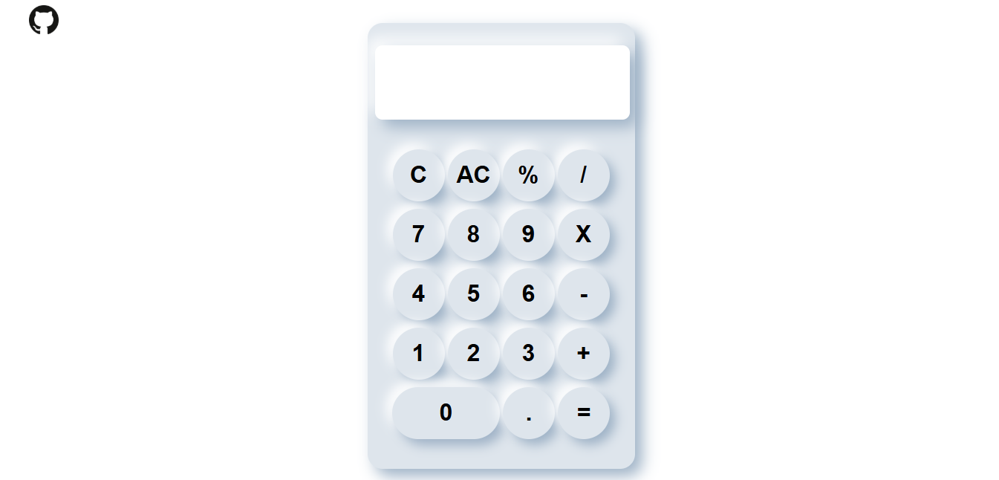

# 💡 Neumorphism Calculator

A modern and stylish calculator built using **HTML, CSS, and JavaScript**, designed with a beautiful **Neumorphism UI**.

---

## 🚀 Features

- Basic operations: Addition, Subtraction, Multiplication, Division
- Percentage and decimal support
- Clear (C) and All Clear (AC) buttons
- Fully responsive layout
- Neumorphic design for a modern look

---

## 🛠 Technologies Used

- HTML5
- CSS3
- JavaScript
